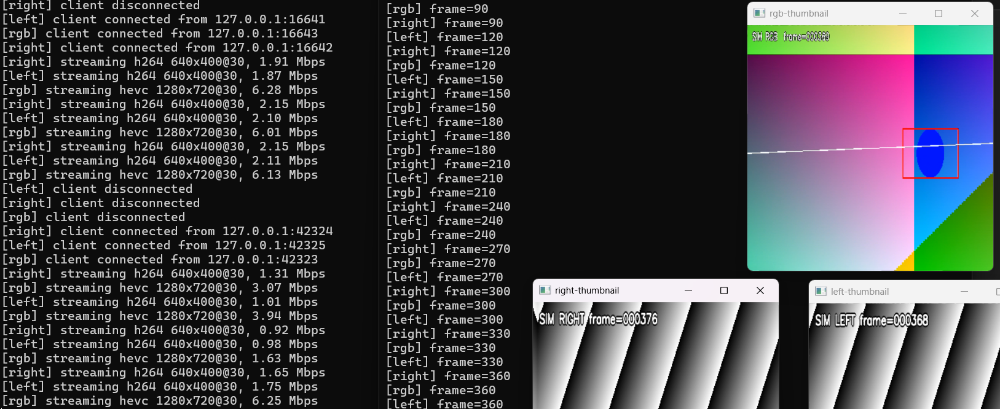

# PyNvVideoCodec + PyTorch TCP Stream Demo

Low-latency NVIDIA GPU video decode from raw TCP streams into PyTorch tensors, with a small simulator for local testing.



This repository contains two focused scripts:

- `pynvvideocodec_ai_client.py`: connects to one or more TCP video streams, decodes them on the GPU with `PyNvVideoCodec`, converts frames to PyTorch tensors through DLPack, and runs a placeholder AI step.
- `tcp_sim_src.py`: acts like a camera-side source for development. It generates synthetic frames or replays a local video file, encodes them with `ffmpeg`, and serves them over TCP using the same stream layout the client expects.

## Stream Layout

The client expects the following ports and codecs:

| Stream | Port | Codec | Typical role |
| --- | ---: | --- | --- |
| `rgb` | `5000` | H.265 / HEVC | Main color stream |
| `left` | `5001` | H.264 | Left mono stream |
| `right` | `5002` | H.264 | Right mono stream |

Default simulator resolutions:

- `rgb`: `1280x720`
- `left` / `right`: `640x400`

## What The Client Does

- Opens one worker thread per selected stream.
- Feeds TCP bytes into `PyNvVideoCodec` through a callback demuxer.
- Decodes directly into device memory on the selected NVIDIA GPU.
- Imports decoded frames into PyTorch with `torch.from_dlpack(...)`.
- Converts frames into `float32` `NCHW` tensors in the `0..1` range.
- Runs a placeholder `DummyAI` module and shows a live OpenCV thumbnail window for each stream.
- Reconnects automatically after socket or decode failures.

## Requirements

- Python `3.10+`
- An NVIDIA GPU with a working CUDA stack visible to PyTorch
- `PyNvVideoCodec`
- `OpenCV`
- `ffmpeg` on `PATH` for the simulator
- `uv` recommended for dependency management

The project is already configured to install CUDA 12.6 PyTorch wheels through `uv`.

## Setup

Install dependencies with `uv`:

```bash
uv sync
```

If you want to run the simulator, make sure `ffmpeg` is installed:

```bash
ffmpeg -version
```

On Debian/Ubuntu, that usually means:

```bash
sudo apt install ffmpeg
```

## Quick Start

### 1. Start the simulator

Run all three streams locally:

```bash
uv run python tcp_sim_src.py --streams rgb,left,right
```

Smoke-test only the RGB stream:

```bash
uv run python tcp_sim_src.py --streams rgb
```

Replay a local video file instead of synthetic frames:

```bash
uv run python tcp_sim_src.py --streams rgb --video-file sample.mp4
```

### 2. Start the GPU decode client

Connect to the simulator on the same machine:

```bash
uv run python pynvvideocodec_ai_client.py --ip 127.0.0.1 --streams rgb,left,right
```

Run only the RGB stream:

```bash
uv run python pynvvideocodec_ai_client.py --ip 127.0.0.1 --streams rgb
```

Select a different GPU:

```bash
uv run python pynvvideocodec_ai_client.py --ip 127.0.0.1 --streams rgb --gpu-id 1
```

## Real Camera Usage

If your device already publishes the same TCP endpoints, point the client at the camera IP:

```bash
uv run python pynvvideocodec_ai_client.py --ip 192.168.1.200 --streams rgb,left,right
```

The current client assumes:

- `rgb` is HEVC on port `5000`
- `left` is H.264 on port `5001`
- `right` is H.264 on port `5002`
- low-latency decoding is appropriate, which generally means the encoder should avoid B-frames

## CLI Summary

### `pynvvideocodec_ai_client.py`

- `--ip`: required camera or simulator IP
- `--streams`: comma-separated list of `rgb,left,right`
- `--gpu-id`: CUDA device index, default `0`

### `tcp_sim_src.py`

- `--host`: bind address, default `0.0.0.0`
- `--streams`: comma-separated list of `rgb,left,right`
- `--fps`: output frame rate
- `--rgb-width` / `--rgb-height`: RGB stream size
- `--mono-width` / `--mono-height`: mono stream size
- `--rgb-bitrate` / `--mono-bitrate`: encoder bitrates
- `--keyframe-seconds`: keyframe interval in seconds
- `--video-file`: optional OpenCV-readable input file
- `--no-loop-video`: stop when the file reaches EOF
- `--ffmpeg-bin`: path or command name for `ffmpeg`
- `--ffmpeg-loglevel`: `quiet`, `error`, `warning`, `info`, or `verbose`
- `--encoder-preset`: ffmpeg encoder preset, default `ultrafast`

## Repository Layout

| Path | Purpose |
| --- | --- |
| `pynvvideocodec_ai_client.py` | GPU decode + PyTorch inference demo client |
| `tcp_sim_src.py` | TCP stream simulator backed by OpenCV and ffmpeg |
| `pyproject.toml` | Project metadata and pinned Python dependencies |
| `uv.lock` | Locked dependency set for `uv` |
| `doc/image.png` | README image asset |

## How The Pipeline Fits Together

1. The simulator creates or reads frames with OpenCV.
2. `ffmpeg` encodes those frames as low-latency H.264 or H.265 elementary streams.
3. The simulator serves encoded bytes over plain TCP.
4. The client feeds socket data into `PyNvVideoCodec` through `CreateDemuxer(...)`.
5. The decoder produces GPU-resident frames in `RGBP` format.
6. PyTorch imports those frames without an extra host copy.
7. The placeholder model performs a trivial inference step and builds a preview thumbnail.

This makes the repo useful both as a quick test harness and as a starting point for a real GPU video inference pipeline.

## Troubleshooting

- `ModuleNotFoundError: No module named 'torch'`
  Install the project environment first with `uv sync`.

- `ERROR: 'ffmpeg' was not found`
  Install `ffmpeg` or pass `--ffmpeg-bin /path/to/ffmpeg`.

- `CUDA is not available to PyTorch`
  Verify the NVIDIA driver, CUDA runtime, and PyTorch CUDA build are aligned on the machine running the client.

- Frequent reconnects or decode failures
  Check that the source codec matches the expected port layout and that the encoder is configured for low-latency streaming without B-frames.

- No preview windows appear
  The client uses OpenCV GUI windows, so it needs a desktop session or a working display bridge.
